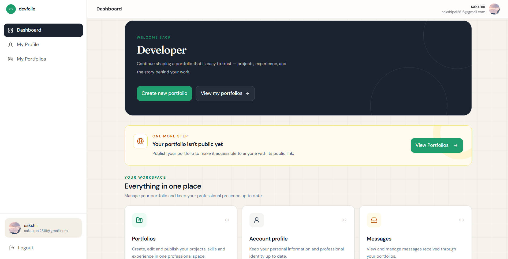
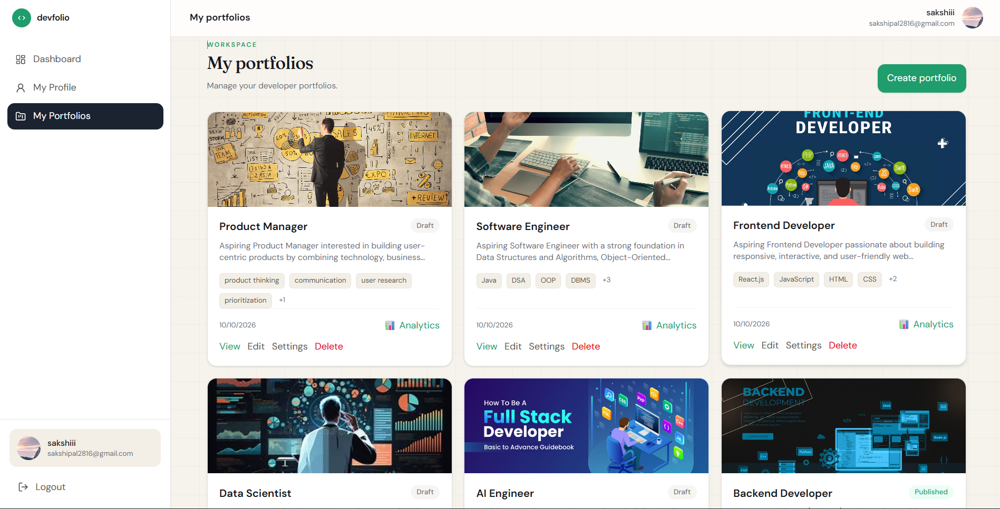
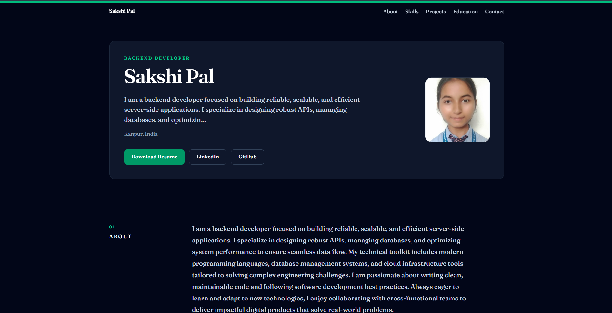
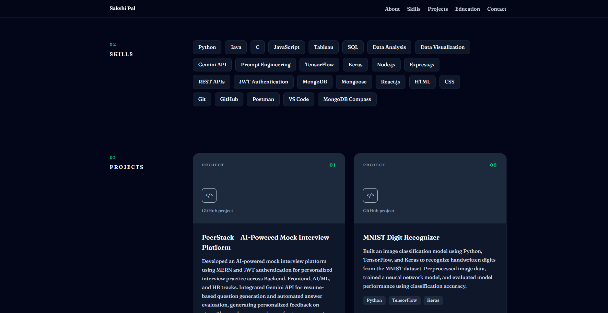
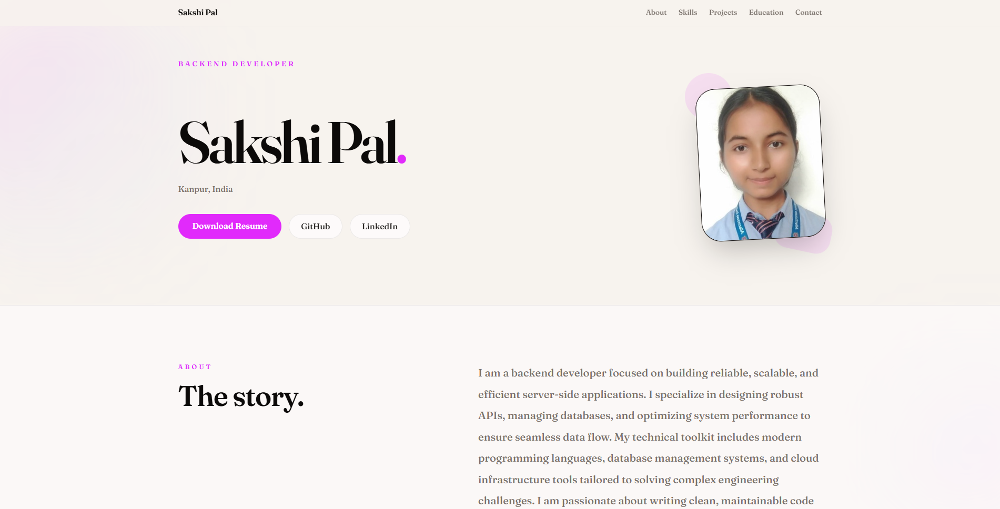
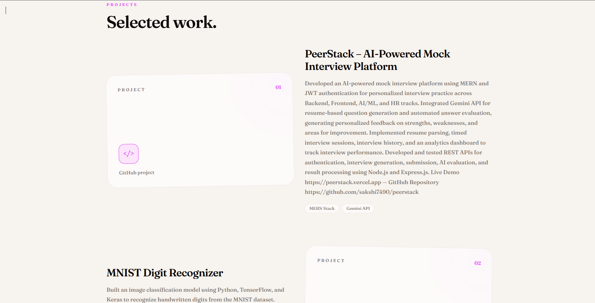
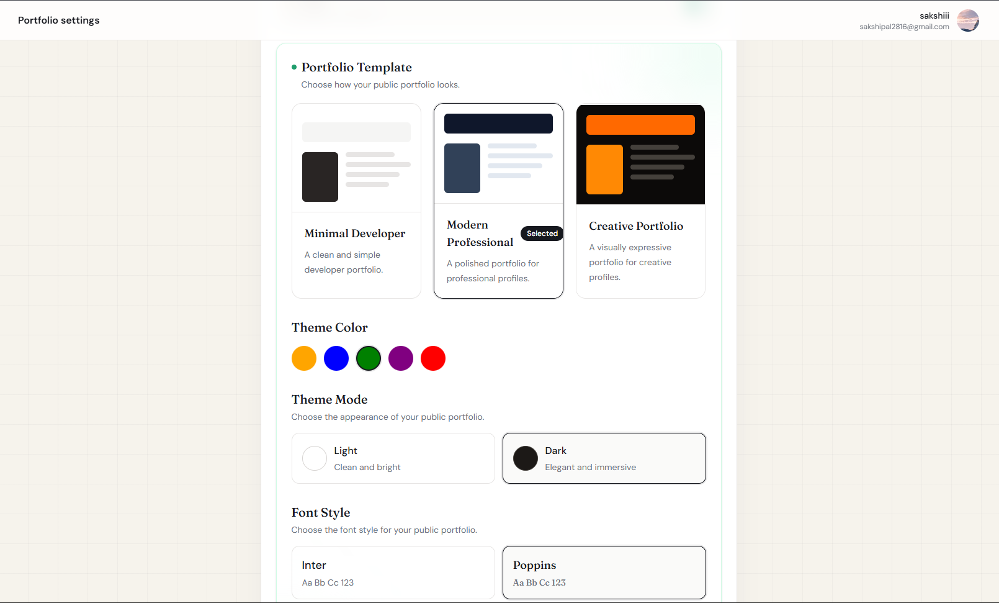

# DevFolio — Portfolio Builder

DevFolio is a full-stack web application that helps users create, customize, manage, and publish their professional portfolios without building a portfolio website from scratch.

## 🌐 Live Demo

- **Frontend:** https://devfolio-kappa-eight.vercel.app/
- **Backend API:** https://devfolio-backend-q3dd.onrender.com

## ✨ Features

- User registration, login, and authentication
- Dashboard for managing portfolios
- Create, view, update, and delete portfolios
- Customize portfolio title, slug, and settings
- Publish and unpublish portfolios
- Edit personal details, hero section, about section, and social links
- Profile image upload using Cloudinary
- Responsive portfolio templates
- AI-powered features using Google Gemini
- Protected routes and portfolio ownership checks

  ## 📸 Screenshots

### Dashboard


### Portfolio Management


### Professional Theme



### Creative Theme



### Portfolio Settings


## 🛠️ Tech Stack

**Frontend**
- React
- Vite
- React Router
- Axios
- Tailwind CSS
- Lucide React

**Backend**
- Node.js
- Express.js
- MongoDB and Mongoose
- JWT authentication
- Joi validation
- Cloudinary
- Google Gemini API

## 📁 Project Structure

```text
DevFolio/
├── backend/
│   ├── src/
│   │   ├── config/
│   │   ├── middleware/
│   │   ├── modules/
│   │   ├── routes/
│   │   ├── app.js
│   │   └── server.js
│   └── package.json
├── frontend/
│   ├── src/
│   └── package.json
└── README.md
```

## ⚙️ Local Setup

### Prerequisites

- Node.js and npm
- MongoDB Atlas account or a local MongoDB instance
- Cloudinary account
- Google Gemini API key if using AI features

### 1. Clone the repository

```bash
git clone https://github.com/sakshi7490/DevFolio.git
cd DevFolio
```

### 2. Configure the backend

```bash
cd backend
npm install
```

Create a `.env` file in the `backend` directory and configure the required environment variables:

```env
PORT=5000
NODE_ENV=development
MONGODB_URI=your_mongodb_connection_string
CLIENT_URL=http://localhost:5173
JWT_SECRET=your_jwt_secret
JWT_EXPIRES_IN=7d
CLOUDINARY_CLOUD_NAME=your_cloudinary_cloud_name
CLOUDINARY_API_KEY=your_cloudinary_api_key
CLOUDINARY_API_SECRET=your_cloudinary_api_secret
MAIL_USER=your_email
MAIL_PASSWORD=your_email_app_password
GEMINI_API_KEY=your_gemini_api_key
```

Use the actual variable names required by your backend configuration. Never commit real credentials.

Start the backend:

```bash
npm run dev
```

### 3. Configure the frontend

Open a second terminal:

```bash
cd frontend
npm install
```

Configure the frontend API base URL to point to the local backend, then start the development server:

```bash
npm run dev
```

Open `http://localhost:5173` in your browser.

## 🔌 API

The backend API base path is:

```text
/api/v1
```

Health-check endpoint:

```http
GET /api/health
```

Example successful response:

```json
{
  "success": true,
  "message": "DevFolio backend is running"
}
```

Protected endpoints require the authentication mechanism configured by the application. Refer to the backend route files for the exact endpoint paths and request payloads.

## 🚀 Deployment

- **Backend hosting:** Render
- **Database:** MongoDB Atlas
- **Image hosting:** Cloudinary
- **Frontend hosting:** See the live frontend link above.

## 🔒 Security

- Keep environment variables and API credentials private.
- Do not commit `.env` files.
- Use production-specific CORS configuration.
- Keep JWT secrets secure.

## 👩‍💻 Contributors

Developed as a collaborative full-stack project.

